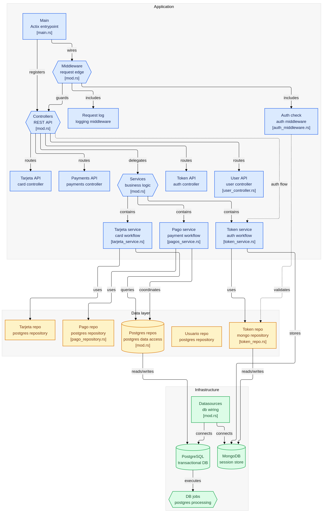

# Meal Cards / Tarjetas Refrigerio

[English](./README.md#english) | [Español](./README.md#español)

---

## Versión en Español

Este proyecto nace de la necesidad de una solución para poder centralizar los pagos de los refrigerios que provee el grupo y se tiene una forma de credito que se maneja con tarjetas pre pagadas de cualquier valor para uno o mas miembros del grupo.

## Arquitectura
Este proyecto esta planteado de la siguiente forma:

---

La base de datos principal es PostgreSQL, en esta se encuentran:

- Job para el procesamiento de comprobantes autorizados y generación de tarjetas.

- Triggers encargados de validar, procesar y actualizar la información interna de los diferentes procesos.

- Tablas con sus respectivos indices para agilitar la busqueda de la información.

La base de datos encargada de administrar las sesiones es MongoDB.

El backend esta escrito en Rust, usando los frameworks: 
- Actix para los servicios REST.

- Diesel como ORM para la generacion de Querys.

- Diesel-Async encargado de la capa asincrona de la comunicacion de la base de datos.

- Tracing para generar una trazabilidad de logs de la peticion a lo largo de todo el flujo.

- JWT para el manejo de sesiones.

- Uso de middlewares para validar la sesion del usuario y generar el span de tracing para los logs de la petición.

---

## English Version

This project stems from the need for a solution to centralize payments for snacks provided by the group, featuring a credit system managed through prepaid cards of any value for one or more group members.

## Architecture
This project is structured as follows:

---

The primary database is PostgreSQL, which includes:

- A background job for processing authorized vouchers and generating cards.

- Triggers responsible for validating, processing, and updating internal information across different processes.

- Tables with their respective indexes to speed up information retrieval.

The database responsible for managing sessions is MongoDB.

The backend is written in Rust, using the following frameworks and tools: 
- Actix for REST services.

- Diesel as the ORM for query generation.

- Diesel-Async handling the asynchronous layer for database communication.

- Tracing to generate log traceability for requests throughout the entire flow.

- JWT for session management.

- Middlewares used to validate user sessions and generate tracing spans for request logs.